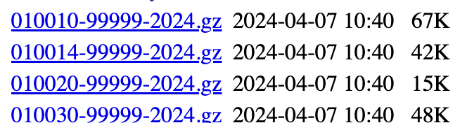
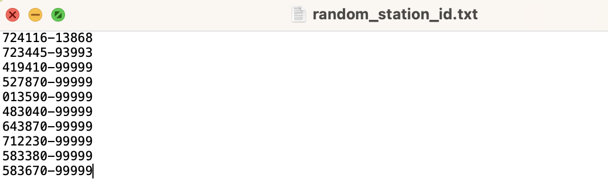

# Purpose

Download data from [NOAA](https://www.ncei.noaa.gov/pub/data/noaa/) for 10 stations each year from 2014 to 2024.

# process

Understand the meaning of gz file's name

The gz files name's format is **{USAF number}-{WBAN number}-{year}**
And we can get all the station number information in the ish-history.csv file

# Download isd-history.csv

Type the command below to download file:

`wget --mirror ftp://ftp.ncdc.noaa.gov/pub/data/noaa/isd-history.csv`

# Use python (on jupyter notebook) to filter qualified station

see code in ./handleData.ipynb file

A new file - qualified.csv has been created, which contains qualified station info.

# Use python (on jupyter botebook) to randomly get 10 station ids, and store them into txt file

see code in ./handleData.ipynb file

Generate a new txt file which contains 10 station ids.

# Write a download.sh to download files

see code in ./download.bash file

# Copy random_station_id.txt which is generated before to the same directory as bash file

Open command line, type command below

`chmod -x download.sh`

`./download.sh`

# Problem

Although we already filter stations which start > 2014 and end > 2024, I still find it is possible that there is no data about a station in a specific year.
10 stations is not a large amount, and only 2 stations are missing, so I manually identified the missing station and added other station data......
